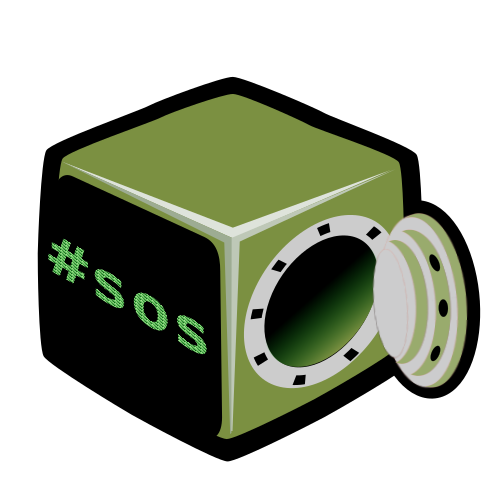
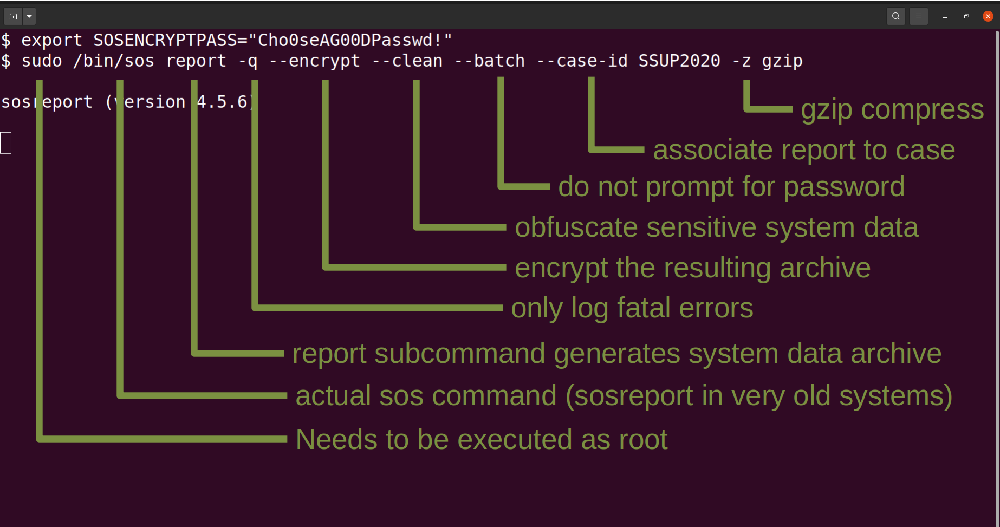
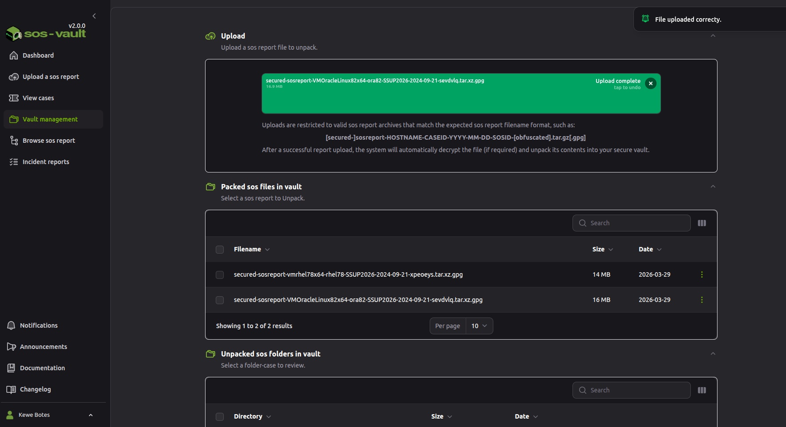
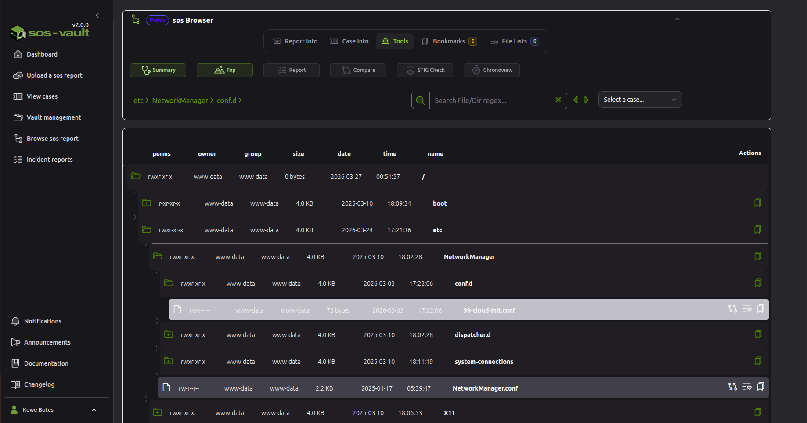
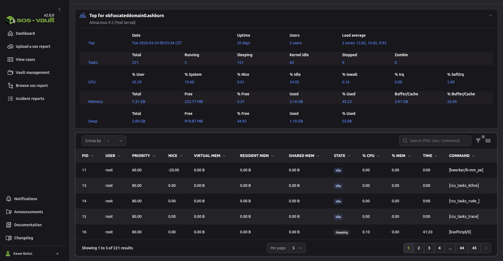
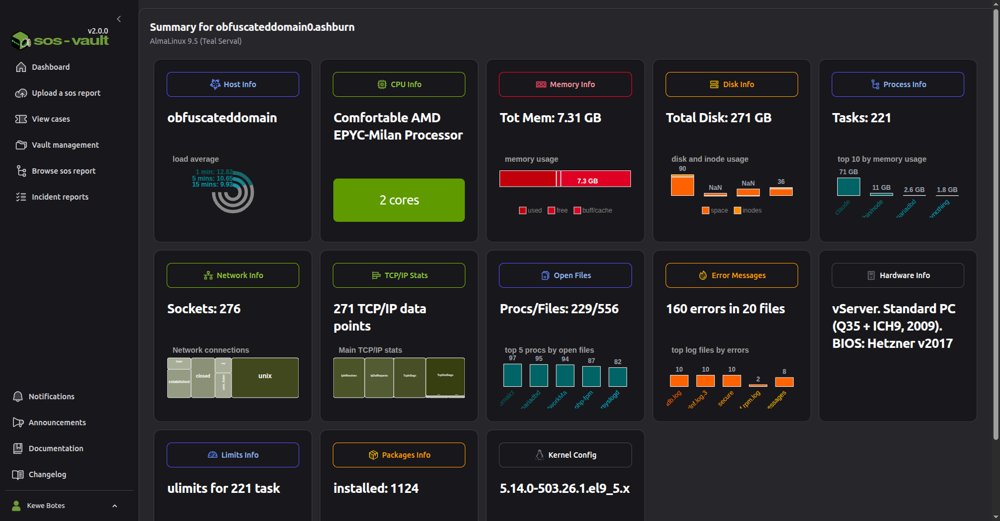
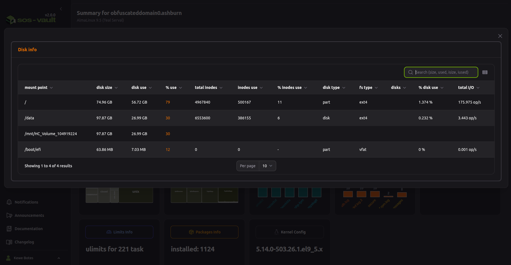
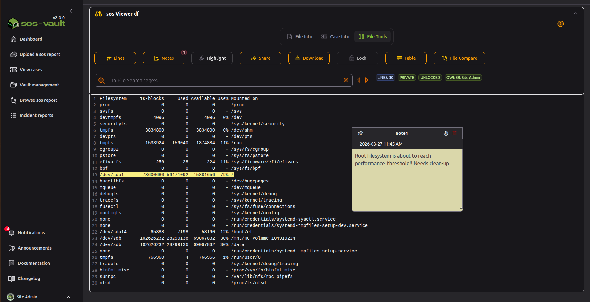
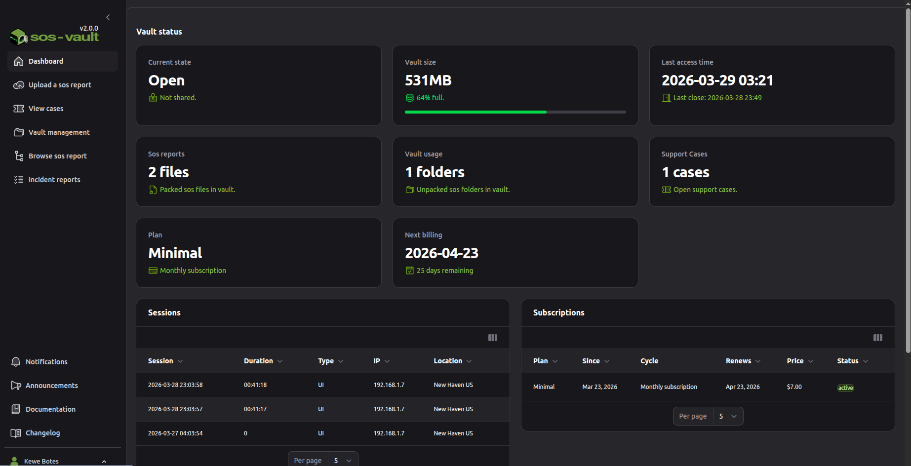
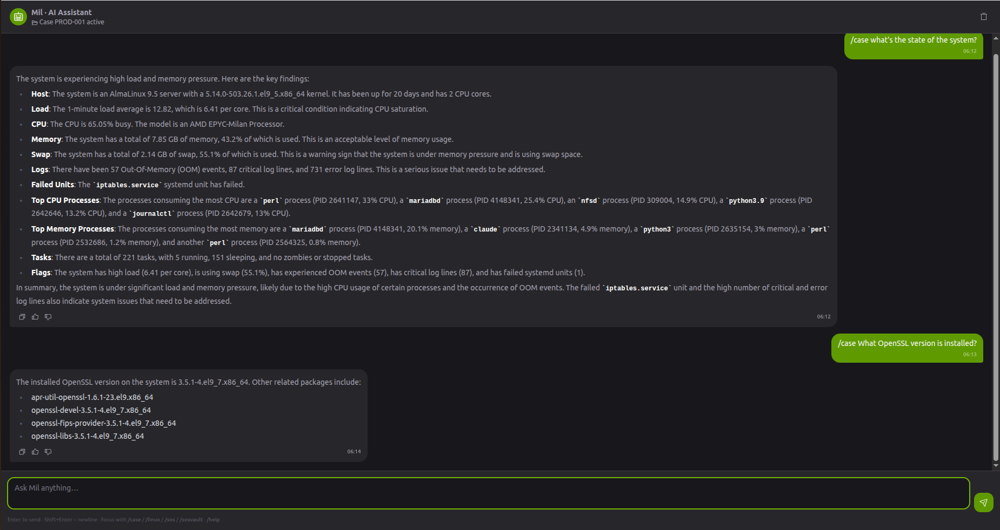

  

  
An sosreport contains a massive amount of system information, but the engineer still has to determine what matters for the incident. Important evidence can be buried across hundreds of files, command outputs, logs and configuration files. Large compressed archives have to be copied, uploaded, downloaded, transferred to support teams and sometimes moved between security zones. Understanding <code>/proc</code>, <code>/sys</code>, systemd, networking, storage, kernel messages, package state, performance data, etc. requires experienced engineers. Engineers repeatedly run the same searches: errors, failed services, network problems, disk issues, CPU/memory pressure, kernel messages, etc. Comparing two servers, two dates, or "before vs. after the incident" normally means manually navigating both reports.

  
sos-vault secures and accelerates Linux incident resolution by turning sosreport archives into AI-assisted, collaborative diagnostic workspaces that help support and operations teams find root causes faster while preserving data privacy and auditability.

  

    
    
    
  

---

## Screenshots

| | |
| --- | --- |
|  **1. Capture** — generate an encrypted, obfuscated sosreport with a single `sos report` command, tagged with a case id. |  **2. Upload** — drag a report into your vault; sos-vault decrypts and unpacks it automatically. |
|  **3. Browse** — walk the full directory tree with permissions, owners, sizes and one-click access to every analysis tool. |  **4. Top** — see live `top`-style CPU, memory and process state exactly as captured. |
|  **5. Summary** — a health dashboard across host, CPU, memory, disk, network, errors and packages. |  **6. Drill down** — click any card for the full underlying data table. |
|  **7. Viewer** — open, search, highlight, annotate and compare individual files, with shareable inline notes. |  **8. Dashboard** — vault status, reports, support cases and sessions at a glance. |
|  **9. Ask Mil** — the built-in AI Assistant answers questions about the loaded case, grounded in the actual report data. | |

---

## Security first (self-hosted and SaaS)

- **Secrets encrypted at rest.** The licensing passphrase, 2FA (TOTP) secrets, and SIEM integration credentials are encrypted at rest, never stored or displayed in plaintext.
- **LUKS2 vault encryption.** Vault contents are stored on independent LUKS2-encrypted volumes (AES-XTS-256) on SaaS and the licensed self-hosted tier, isolating every user's or team's data in its own container. *The free open-core baseline uses a plain, unencrypted vault directory — full-disk vault encryption unlocks with a license.*
- **HTTPS everywhere.** All web and API traffic is served over TLS; a certificate is generated at install time and can be swapped for your own via the built-in Certificate Manager.
- **Automatic housekeeping.** Shared file links, annotations, and audit-log entries carry expiry timestamps and are purged automatically on an hourly schedule. Your sosreports and vault contents are never silently deleted — they're retained until you remove them.
- **Deletion on request.** Admins can permanently destroy a vault and its contents, and delete the associated account, on request — for SaaS, contact support to trigger this.
- **AI Assistant runs local by default.** The bundled Mil assistant uses an on-box model out of the box, so no report data leaves the system unless you deliberately configure a cloud AI provider (OpenAI/Anthropic). If you do, only the relevant portions of the current sosreport are sent to that provider's API to answer your question — nothing else in sos-vault sends report data off-box.
- **Self-hosted option for air-gapped environments.** The open-core and licensed self-hosted builds need no internet access for day-to-day use — upload, decrypt, browse, licensing, and 2FA all work fully offline. (The AI Assistant's local model is the one component that needs a one-time download, or manual side-load, before it can run fully air-gapped.)

---

## Get started

> **Try SaaS free.** Watch sos-vault in action on [sos-vault.com/login](https://sos-vault.com/login). Login with your Google account and go to **Browse sos report**, where an already-uploaded sosreport is waiting for you to analyze.

| | |
| --- | --- |
| 🚀 **Install in 10 minutes** — `.deb` / `.rpm` packaged installer for Ubuntu and RHEL hosts. | [→ `docs/INSTALL.md`](docs/INSTALL.md) |
| 🐳 **Try with Docker Compose** — kick the tires before committing to a real install. | [→ `docs/QUICKSTART_DOCKER.md`](docs/QUICKSTART_DOCKER.md) |
| 💳 **Buy a Pro license** — multi-user, groups, modules, ITSM, encrypted vaults, event log. | [→ sos-vault.com](https://sos-vault.com) |

## Feature matrix

| | Community  (AGPL, self-hosted) | SaaS  ([sos-vault.com](https://sos-vault.com)) | Commercial Self-Hosted  (licensed) |
| --- | :---: | :---: | :---: |
| Cost | Free, forever | Subscription per seat | License fee, hardware-bound |
| Runs on | Your infrastructure | Hosted by sos-vault | Your infrastructure |
| Users | 1 (single admin) | 1–20+ per plan | Multi-user, seat-capped by license |
| Teams / shared vaults | — | Team & Enterprise plans | ✅ Groups, shared LUKS vault |
| Vault encryption | Plain directory | LUKS-encrypted (hosted) | LUKS-encrypted (self-hosted) |
| Upload · decrypt · browse · annotate · export | ✅ | ✅ | ✅ |
| AI Assistant | ✅ Local (bundled Ollama model) | ✅ Cloud AI included | ✅ Local, or bring your own OpenAI / Anthropic key |
| ITSM integration (Jira / JSM) | — | ✅ | ✅ |
| SIEM / Syslog forwarding | — | ✅ | ✅ |
| Module add-ons | — | — | ✅ |
| Event log / audit trail | — | ✅ | ✅ |
| Telemetry / phone-home | None | N/A (hosted) | None |
| Support | Community (GitHub Discussions/Issues) | Included | Included |

See [`docs/FEATURES.md`](docs/FEATURES.md) for the full open-core vs. licensed breakdown.

---

## Overview

SOS-Vault solves a real-world problem for Linux support teams: **sosreports are large, noisy, and time-consuming to analyze manually**. SOS-Vault provides:

- **Encrypted personal vaults** — each user's data is stored in a dedicated LUKS container, never co-mingled with other users' data.
- **Structured browsing** — navigate a sosreport's directory tree in a browser, open files instantly, and search across the entire archive.
- **AI analysis** — integrate with OpenAI or Anthropic to generate automated root cause assessments and health summaries.
- **Team collaboration** — annotate files, share findings, open support cases, and coordinate resolution across a team.
- **ITSM integration** — sync cases from Jira / Atlassian JSM directly into the platform.
- **Professional reporting** — generate PDF-ready root cause analysis documents enriched with live subsystem data.
- **SIEM integration** — SOS-Vault generates events on all actions that can be forwarded as JSON payloads to any SIEM platform, in Elastic Common Schema (ECS) format, over Syslog (TCP / UDP / TLS).

---

## Why sos-vault

- **Free single-admin baseline, forever.** Install it, run it on your own box, never call home, never pay a cent. The open-core build is fully usable for solo practitioners and homelab operators.
- **AGPLv3 source.** Audit every line, fork the project, run it inside your VPC, build your own integrations. Network-use copyleft means anyone forking it as a service must share their diffs back.
- **Hardware-bound licensing for the paid tier.** When you outgrow the single-admin baseline, a license file unlocks multi-user, team groups, modules, ITSM integration, encrypted vaults, and the event log. The license is cryptographically bound to the exact machine — no transferable seats, no phone-home telemetry, no SaaS lock-in.
- **No telemetry by default.** sos-vault does not contact the mothership unless you upload a sosreport on purpose.

## Key Features

### Vault & Storage
- **LUKS-encrypted vaults** — one per user (or shared per team), provisioned and managed by a privileged system helper
- **Automatic vault lifecycle** — create, open, close, expand, shrink, and destroy vaults from the admin panel
- **Direct upload** — push sosreport archives from the command line via authenticated API
- **Auto-extract & analyze** — uploaded archives are automatically decrypted, unpacked, and indexed

### Analysis Tools
| Tool | Description |
|------|-------------|
| **sos Browser** | Navigate the full sosreport directory tree |
| **sos Viewer** | Open, search, annotate, share, and download individual files |
| **Summary** | System health dashboard with subsystem drill-down |
| **Top** | `top`-style system status at the time of capture |
| **Compare** | Side-by-side diff of two sosreports at directory and file level |
| **File Compare** | Per-file diff viewer with syntax highlighting |
| **AI Assistant (Mil)** | Chat with an AI assistant grounded in the loaded case — ask about system state, correlate logs, and get root-cause suggestions from the actual report data |
| **Report** | AI-enriched root cause analysis editor with PDF export |
| **Bookmarks** | One-click access to frequently used files across reports |
| **File Lists** | Grouped file sets — open all relevant logs for a subsystem at once |
| **File Search** | Regex-powered filename search across the archive |
| **In-File Search** | Full-text search across all files in a sosreport |

### Collaboration & Workflow
- **Annotations** — inline comments on file lines, shareable with teammates
- **Support cases** — link one or more sosreports to a case, track status
- **ITSM sync** — pull cases from Jira/JSM; ServiceNow and PagerDuty planned
- **Telegram notifications** — get alerted on case events via bot

### Admin Panel
- Full Filament-based admin: manage users, plans, roles, announcements, and billing
- User impersonation for support and troubleshooting
- Vault management per user (open/close/expand/shrink/delete) without SSH access
- Module system for optional add-on tools
- **Complete activity audit trail** — every action, by admins and users alike, emits a structured event, giving you a full, tamper-evident log of all sos-vault activity for compliance and forensics

---

## Documentation

| Topic | What it covers |
| --- | --- |
| [Installation guide](docs/INSTALL.md) | Hardware requirements, the 15-step installer, first-boot admin seeding, 2FA enrollment, TLS certificate setup. |
| [Configuration reference](docs/CONFIGURATION.md) | Settings table layout, environment variables, sysadmin helper scripts. |
| [AI assistant (Mil)](docs/AI_ASSISTANT.md) | The bundled local model, enabling OpenAI / Anthropic for full sosreport analysis, and how to obtain an API key. |
| [Open-core vs Pro feature matrix](docs/FEATURES.md) | Exactly what is gated behind a license, and what you get for free. |
| [Architecture overview](docs/ARCHITECTURE.md) | High-level diagram of the app, the licensing model, the vault layer, the helpers. |
| [License-request flow](docs/LICENSE_REQUEST.md) | How to generate a license-request sosreport and upload it for minting. |
| [Module development](docs/MODULES.md) | Authoring `.tar.gz` modules and the optional GPG-signed module-install path. |
| [Upgrade notes](docs/UPGRADING.md) | Release-by-release breaking-change notes and migration steps. |

## Get involved

- **GitHub Discussions** for questions and design conversation: see the Discussions tab on this repository.
- **Issues** for bug reports, feature requests, and roadmap input.
- **Security disclosures** — please do NOT open public issues for security issues. Email `security@sos-vault.com`. See [`SECURITY.md`](SECURITY.md) for the full policy.
- **Community forum** — `community.sos-vault.com` (link populated once the forum is live).

## Contributing

We welcome contributions — bug fixes, documentation improvements, module authors, and translation reviewers especially. Start with [`CONTRIBUTING.md`](CONTRIBUTING.md) for setup instructions and the PR checklist. By contributing you agree to the [Code of Conduct](CODE_OF_CONDUCT.md).

## License

sos-vault is released under the [GNU Affero General Public License v3.0 or later](LICENSE).

The license-enforcement mechanism — signed `.lic` files bound to host machine tokens — is itself AGPL-licensed. See [`NOTICE`](NOTICE) for a deeper explanation of how the open-core boundary is drawn.

"sos-vault" and the sos-vault logo are trademarks. See [`TRADEMARKS.md`](TRADEMARKS.md) for the usage policy.
